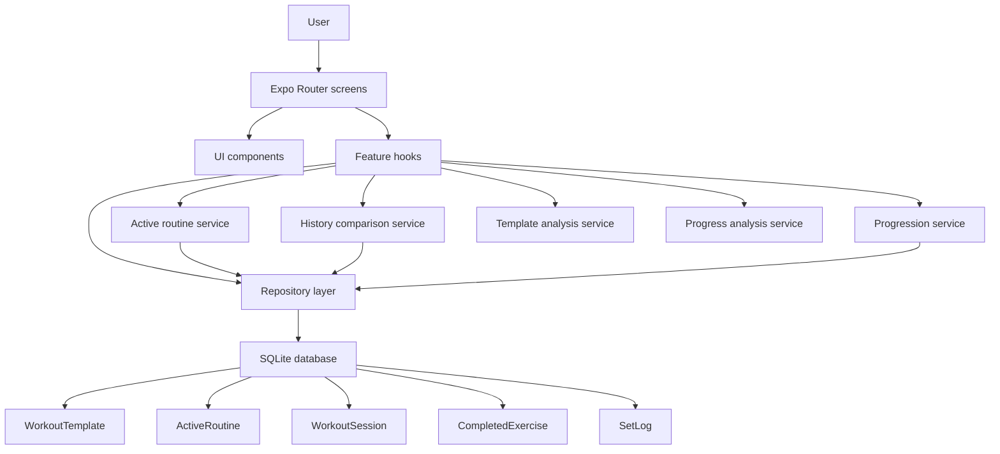

# ARCHITECTURE

## Architecture summary

HIT Log V2 should use a thin screen layer, reusable components, a repository layer for local persistence, and small domain services for active-routine logic, history comparison, and progression recommendations.

The core V2 product flow is:

```txt
Template Library -> Active Routine -> Workout Session -> History Comparison -> Progression Recommendation -> History Review
```

## Guiding decisions

| Decision | Recommendation |
|---|---|
| Router | Expo Router |
| Language | TypeScript, strict mode |
| Persistence | expo-sqlite |
| Data access | Repository pattern |
| Primary ID strategy | TEXT UUIDs |
| Timestamp format | ISO 8601 strings |
| UI state | Local component state + hooks |
| Sync | None in V2 MVP |
| Progression | Deterministic domain service |
| Charts | Gated Phase 8 progress views from completed V2 workout data |

Core entities should include `id`, `createdAt`, and `updatedAt` where appropriate.

## Domain boundaries

Templates, active routines, workout sessions, completed exercises, set logs, and progression recommendations are separate concepts.

- A template is a reusable plan.
- An active routine is the user's currently selected running plan.
- V2 allows only one active routine at a time.
- A workout session is an actual performed workout.
- Planned exercises and performed exercises are separated.
- Substitutions are tracked without corrupting the original template or original exercise progression history.
- Barbell bench and dumbbell bench have separate progression histories.
- Progression recommendations are generated from completed working sets and the exercise's progression policy.
- Warmups are excluded from progression calculations.
- Template analysis is generated from planned exercise prescriptions, not completed workout history.
- Local-first data remains export-friendly.

## Why ActiveRoutine exists

`WorkoutTemplate` describes a reusable plan. It should not also carry the user's current position, next workout, or running status.

`ActiveRoutine` represents the user's selected routine in motion. It can track the selected template, current day, status, and next workout logic while leaving the underlying template reusable and safe to duplicate or inspect. This separation lets the app support a library-first state before selection, then a guided Train state after selection.

## Architecture diagram



## Core entities

### WorkoutTemplate

Reusable training plan. Can be prebuilt or custom.

Key notes:

- Prebuilt templates are read-only.
- Custom templates are editable.
- Prebuilt templates can be duplicated into custom templates.
- A template contains one or more `TemplateDay` records.
- Structural edits to custom templates go through the template repository so source/editability checks, ordering, and active-routine safety stay centralized.

Suggested fields:

- `id`
- `name`
- `description`
- `source`: `prebuilt | custom`
- `goal`
- `daysPerWeek`
- `createdAt`
- `updatedAt`

### ActiveRoutine

The user's currently selected routine. Tracks current day, status, and next workout logic.

Key notes:

- V2 supports one active routine at a time.
- The active routine references a template but does not mutate the template during workout execution.
- Advancing the active routine should happen after a completed workout.
- If a custom template edit deletes the active routine's current day, the active routine should be moved to a remaining day instead of retaining an invalid reference.

Suggested fields:

- `id`
- `templateId`
- `status`: `active | paused | completed | archived`
- `currentTemplateDayId`
- `startedAt`
- `lastWorkoutSessionId`
- `createdAt`
- `updatedAt`

### TemplateDay

One workout day inside a template, such as Full Body Day A, Push, Pull, or Legs.

Suggested fields:

- `id`
- `templateId`
- `name`
- `orderIndex`
- `notes`
- `createdAt`
- `updatedAt`

### ExerciseDefinition

Reusable exercise metadata, such as name, primary muscle group, secondary muscle groups, category, default rep range, default progression method, and default load increment.

Suggested fields:

- `id`
- `name`
- `primaryMuscleGroup`
- `secondaryMuscleGroups`
- `category`
- `defaultRepMin`
- `defaultRepMax`
- `defaultProgressionMethod`
- `defaultLoadIncrement`
- `defaultRestSeconds`
- `createdAt`
- `updatedAt`

### ExercisePrescription

A planned exercise inside a template day. Stores planned sets, rep range, progression policy, order, and notes.

Progression happens at this level so different exercises in the same workout can use different progression methods.

Suggested fields:

- `id`
- `templateDayId`
- `exerciseDefinitionId`
- `orderIndex`
- `sets`
- `repMin`
- `repMax`
- `muscleGroup`
- `progressionPolicyId`
- `loadIncrement`
- `restSeconds`
- `notes`
- `createdAt`
- `updatedAt`

### ProgressionPolicy

Defines how next-session recommendations are calculated.

Supported V2 methods:

- `double_progression`
- `top_set_progression`
- `rep_progression`
- `manual`
- `none`

Suggested fields:

- `id`
- `method`
- `loadIncrement`
- `targetRepMin`
- `targetRepMax`
- `notes`
- `createdAt`
- `updatedAt`

### WorkoutSession

An active, completed, or abandoned workout.

Key notes:

- A session is actual performed training.
- It may start from an active routine and template day.
- Active workout sessions can be autosaved locally before completion so interrupted workouts resume with logged set data.
- Completed sessions become durable history records.

Suggested fields:

- `id`
- `activeRoutineId`
- `templateDayId`
- `status`: `active | completed | abandoned`
- `startedAt`
- `completedAt`
- `notes`
- `createdAt`
- `updatedAt`

### CompletedExercise

What the user actually performed during a workout. Can match the planned exercise or represent a substitution.

Key notes:

- `exerciseDefinitionId` should identify the performed movement.
- `plannedExercisePrescriptionId` can point back to the original planned exercise.
- Substitutions should not silently mutate the template.
- Optional effort/RIR belongs at this level for V2.

Suggested fields:

- `id`
- `workoutSessionId`
- `plannedExercisePrescriptionId`
- `exerciseDefinitionId`
- `isSubstitution`
- `substitutedForExerciseDefinitionId`
- `orderIndex`
- `notes`
- `effortRating`: `easy | moderate | hard | failure`
- `estimatedRir`: `3 | 2 | 1 | 0`
- `createdAt`
- `updatedAt`

### SetLog

A single logged set. Should include weight, reps, set number, and `isWarmup`.

Warmup sets may be logged, but they do not count toward progression recommendations, PRs, working-set volume, charts, or muscle-group weekly set totals.

Suggested fields:

- `id`
- `completedExerciseId`
- `setNumber`
- `weight`
- `reps`
- `isWarmup`
- `notes`
- `createdAt`
- `updatedAt`

### ProgressionRecommendation

A deterministic recommendation for what to do next time, including recommendation type, recommended weight, recommended rep target, reason, and the previous performance used.

Recommendations may be calculated on demand or persisted if the app needs a stable audit trail after workout completion.

Suggested fields:

- `id`
- `exercisePrescriptionId`
- `exerciseDefinitionId`
- `method`
- `recommendationType`
- `recommendedWeight`
- `recommendedRepTarget`
- `reason`
- `previousPerformanceSummary`
- `sourceWorkoutSessionId`
- `createdAt`
- `updatedAt`

## Progression service

Progression should be deterministic, explainable, and testable. V2 should not use AI for progression.

Inputs:

- exercise prescription
- progression policy
- completed working sets
- relevant prior sessions
- warmup exclusion

Outputs:

- recommendation type
- recommended weight
- recommended rep target
- reason text
- previous performance used

Load-only progression is not part of V2 scope.

## History comparison service

History comparison should make progressive overload visible during training.

For a given exercise, the service should return:

- last time
- best ever / PR
- last five sessions
- notes from prior sessions

Working sets should be used for comparison. Warmups should be excluded.

## Workout draft recovery

Phase 7 keeps in-progress workout recovery local-first by autosaving active `WorkoutSession` drafts through the workout session repository. Draft saves update completed-exercise notes, effort, substitutions, and set logs while the session remains `active`.

Rules:

- Draft saves must not complete the workout or advance the active routine.
- Draft saves should preserve warmup flags so warmups remain excluded from progression and history calculations.
- Train should route back to the active local workout session when one exists.
- Completion remains the explicit transition that marks the session completed and advances the active routine.

## Template analysis service

Template analysis should make planned routine structure explainable before Progress charts exist.

Inputs:

- workout template detail
- template days
- exercise prescriptions
- prescription muscle groups
- prescribed set counts

Outputs:

- prescribed working sets by muscle group
- total prescribed working sets
- template or rotation day count label
- notable muscle bias
- goal fit label and summary
- undertrained indicators
- overloaded indicators

The service must stay deterministic and testable. It must not read completed workout sessions, set logs, legacy Yates data, chart state, or remote services.

Phase 5 target-profile constants live in `lib/template-analysis.ts`. Current metadata counts a prescription toward its available `muscleGroup`; Phase 9 may improve this with richer primary and secondary muscle metadata. Do not add fractional secondary-muscle counting until the data model supports it cleanly.

## Progress analysis service

Phase 8 progress analysis is deterministic and testable. The repository boundary reads completed V2 workout data from `workout_sessions`, `completed_exercises`, `set_logs`, and `exercise_definitions` metadata. The pure analysis layer lives in `lib/progress-analysis.ts`.

Inputs:

- completed V2 workout sessions
- completed working sets with reps logged
- exercise identity, display name, and available muscle-group metadata

Rules:

- Unlock Progress charts only after at least 4 completed V2 workouts, at least 2 calendar weeks with completed V2 workouts, and at least one exercise with 2 or more completed exposures.
- Show exercise trends only for exercises with at least 2 completed exposures.
- Exclude warmup sets from charts, progression indicators, working-set volume, and muscle-group weekly set totals.
- Exclude blank or incomplete sets.
- Use weighted `weight x reps` volume only when weight exists.
- Show reps history instead of fake volume when an exercise has reps-only data.
- Count available exercise muscle-group metadata directly; do not add fractional secondary-muscle counting in Phase 8.

Outputs:

- baseline gate status
- dashboard metrics
- exercise strength trend points
- exercise volume or reps-history trend points
- weekly muscle-group working sets
- completed-workout consistency by week
- cautious top-progress and needs-attention indicators

The progress service must not read legacy Yates tables, bodyweight data, wearable data, cloud data, or remote services.

## Custom template editing

Phase 6 structural template edits are repository-owned local SQLite mutations.

Rules:

- Prebuilt templates remain read-only at both UI and repository levels.
- Custom template day edits can add, rename, reorder, and delete days, but deletion must preserve at least one day.
- The UI should disable or block final-day deletion, but the repository remains the final guard against zero-day custom templates.
- Custom exercise prescription edits can add from existing exercise definitions, remove, reorder, and update sets, rep range, progression method, rest guidance, and notes.
- Supported progression methods remain `double_progression`, `top_set_progression`, `rep_progression`, `manual`, and `none`; load-only progression is not introduced.
- Deleting an active routine's current day updates the routine to a remaining day before the day is deleted.
- Removing a prescription clears completed-exercise foreign-key references to that prescription so historical completed exercise snapshots remain readable while the custom template changes.

## Substitution rules

- A workout substitution creates a performed exercise record tied to the session.
- The original template prescription remains unchanged.
- The app may offer to save the substitution back to a custom template after completion.
- Saving changes back to a custom template must be explicit.
- Prebuilt templates remain read-only.
- Different movements keep separate progression histories.

## Local-first and export-friendly structure

SQLite remains the local persistence layer. Data should be normalized enough that templates, active routine state, sessions, completed exercises, set logs, notes, and progression context can be exported without parsing display-only strings.

Prefer stable IDs, ISO timestamps, explicit foreign keys, and deterministic enum values.

## Suggested repository modules

```txt
db/
  repositories/
    templates.ts
    activeRoutine.ts
    exerciseDefinitions.ts
    workoutSessions.ts
    history.ts
    progressionRecommendations.ts
    progress.ts

lib/
  activeRoutine.ts
  historyComparison.ts
  progression.ts
  templateDuplication.ts
  workoutSubstitutions.ts

types/
  domain.ts
  db.ts
```

## Suggested validation scripts

| Script | Purpose |
|---|---|
| validate-db.ts | Tables, indexes, PRAGMAs, and foreign keys exist |
| validate-prebuilt-templates.ts | Initial prebuilt templates are present and read-only |
| validate-active-routine.ts | One active routine and next-workout behavior are correct |
| validate-history-comparison.ts | Last time, PR, last five sessions, and notes are returned correctly |
| validate-progression.ts | Progression policies produce deterministic recommendations |

## Canonical enum values

### Template source

- `prebuilt`
- `custom`

### Active routine status

- `active`
- `paused`
- `completed`
- `archived`

### Workout session status

- `active`
- `completed`
- `abandoned`

### Progression method

- `double_progression`
- `top_set_progression`
- `rep_progression`
- `manual`
- `none`

### Effort rating

- `easy`
- `moderate`
- `hard`
- `failure`
